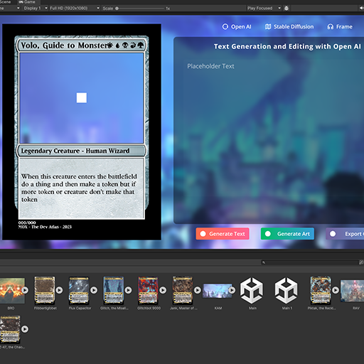
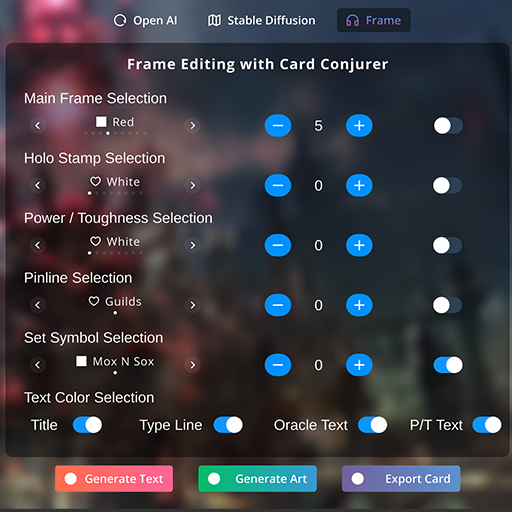
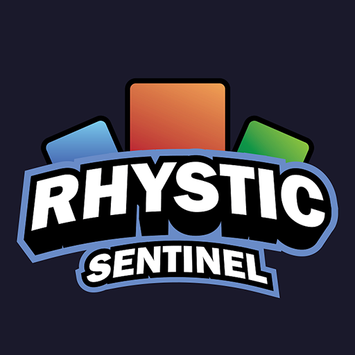

# 🪄 Rhystic-Sentinel 🎴

**'Using AI and Unity To Create Custom Magic The Gathering Cards'**

---

Rhystic Sentinel is my custom card creator for people to make there own Magic Cards.

Over time this project has evolved to support other card games like Universus and I plan to add card support for other games.

Read my article on the subject on [TheDevAtlas.com](https://www.thedevatlas.com/the-log/polygonization-of-a-scaler-field-in-real-time) coming soon
Go use the current version on [Itch.io](https://thedevatlas.itch.io/rhystic-sentinel)
Go use my old program - [Legacy Itch.io](https://thedevatlas.itch.io/rhystic-sentinel-legacy)

---

  
  
  

